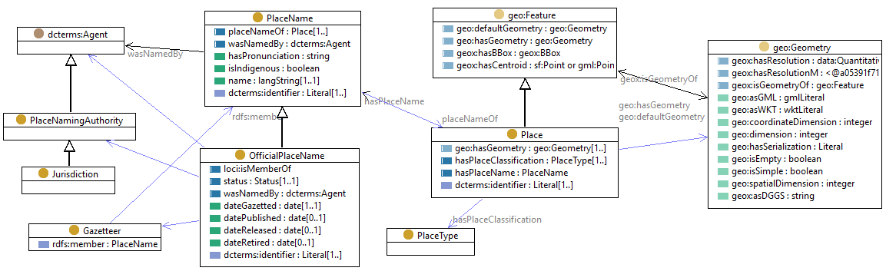

  # semadaten: Semantic Data Enrichment

This is the repository of source codes and datasets for a transparent and reproducible semantic data enrichment of foundation spatial data. The repository is developed and organised by Geographic Knowledge Lab (GKL). 

## Key resources 

- [Geoscience Australia Place Names Ontology](https://geoscienceaustralia.github.io/Placenames-Ontology/placenames.html);
- [Geoscience Australia Place-Names GitHub repository](https://github.com/GeoscienceAustralia/Placenames-Ontology);
- [Composite Gazetteer of Australia](https://placenames.fsdf.org.au/);
- [Data Product Specification for the Composite Gazetteer of Australia](data/CompositeGazetteerDPS.pdf);
- [Linked Data API codebase for National Composite Gazetteer of Australi](https://github.com/GeoscienceAustralia/placenames-dataset); and
- [RML tools](https://rml.io/tools/);

## Repository structure

- **data**: Folder with data from official gazetteers that was linked and enriched in the Place Names Knowledge Graph (PNKG).
- **doc**: Project documentation and examples. 
- **lib**: External libraries and software.
- **pnkg**: Documentation and a link for downloading the PNKG. 
- **src**: RML mapping scripts and data processing codes.

## Data

- Gazetteers directly available in the repository for ACT, NSW, NT, QLD, TAS, VIC, and WA.
- For SA only external link available to download official place names gazatteer due to large file size.
- Data downloaded from authoritative organisations (state) for NSW, QLD, SA< VIC, and WA.
- For ACT, NT, and TAS place names gazetteers were downloaded from the national database, the Composite Gazetteer of Australia. 
- The list of authoritative and non-authoritative organisations for place name gazetteers is available on the [Intergovernmental Committee on Surveying and Mapping (ICSM) website](https://www.icsm.gov.au/individual-state-and-territory-gazetteers).

| Jursdiction | Metadata |                                                                Download Link                                             | Data in GitHub | Last Updated |
| :-------: | ----------- | ------------------------------------------------------------------------------------------------------------------------- | :--------------: | :------------:|
| **ACT** | [Web Link](https://www.data.act.gov.au/dataset/ACT-Feature-Names/kpm6-igvw/about_data)   | [ACT place names in the Composite Gazetteer of Australia](https://placenames.fsdf.org.au/)                  |   [ACT.csv](data/ACT/ACT.csv)  |  06/12/24  |
| **NSW** | [Web Link](https://data.nsw.gov.au/data/dataset/geographical-name-register-of-nsw)         | [Official NSW place names gazetteer](https://data.nsw.gov.au/data/dataset/geographical-name-register-of-nsw/resource/af4e95e2-0dda-44c4-9324-4a025169545c) | [NSW.csv](data/NSW/NSW.csv)        | 16/03/25 |
| **NT**  | [Web Link](https://www.ntlis.nt.gov.au/metadata/export_data?metadata_id=2DBCB7711FB306B6E040CD9B0F274EFE&type=html) | [NT place names in the Composite Gazetteer of Australia](https://placenames.fsdf.org.au/) |  [NT.csv](data/NT/NT.csv)  |  24/11/24 |
| **QLD** | [Web Link](https://www.data.qld.gov.au/dataset/place-names-gazetteer-queensland/resource/ddbaa459-6630-4d89-8221-0fd8da7df39a) | [Official QLD place names gazetteer](https://www.qld.gov.au/environment/land/title/place-names/search)           | [QLD.csv](data/QLD/QLD.csv) |  20/03/25 |
| **SA**  | [Web Link](https://data.sa.gov.au/data/dataset/gazetteer)         | [Official SA place names gazertteer](https://data.sa.gov.au/data/dataset/gazetteer) | [Sites.csv](https://drive.google.com/file/d/1aZxHk-g5_0KRaAOG9w6PuUEHTO2c3QG1/view?usp=sharing); [Lines.csv](https://drive.google.com/file/d/19QUnO59D8vHqY7HME0v3F8kzmMoj4gBl/view?usp=sharing); [Areas](https://drive.google.com/file/d/1Yrc9v_O6KvdtiW75PUFzfZD6bERJ4pxi/view?usp=sharing)              | 17/03/25  |
| **TAS** | [Web Link](https://data.thelist.tas.gov.au/datagn/srv/eng/main.home?uuid=d193cd7a-d93a-4ca8-a0a3-670929ad247a)         | [TAS place names in the Composite Gazetteer of Australia](https://placenames.fsdf.org.au/)                     |  [TAS.csv](data/TAS/TAS.csv) | 24/11/24 |
| **VIC** | [Web Link](https://metashare.maps.vic.gov.au/geonetwork/srv/eng/catalog.search#/metadata/b236fd06-a7fc-5ced-8b98-1f022a329b11)          | [Official VIC place names gazetteer](https://maps.land.vic.gov.au/lassi/VicnamesUI.jsp)   | [Sites.csv](data/VIC/VICSites.csv); [Roads.csv](data/VIC/VICRoads.csv)   | 01/03/25 |
| **WA**  | [Web Link](https://catalogue.data.wa.gov.au/dataset/geographic-names-geonoma) | [Official WA place names gazetteer](https://catalogue.data.wa.gov.au/dataset/geographic-names-geonoma)           | [WA.csv](data/WA/WA.csv)               | 24/11/24 |

## Place Name ontology
The below image shows the snapshot of the classes, Object Property (OP), and Data Property (DP) of the [Geoscience Australia Place Name ontology](https://geoscienceaustralia.github.io/Placenames-Ontology/placenames.html). Defined relations in the ontology are used for RML mapping and building PNKG. 



## Installation
###  RMLmapper java 
#### Prerequisites 
* Java 17 is the minimum required version for compiling and running the current version of the project. <br>
* Development environments (IDEs) such as Visual Studio Code (VS Code), Eclipse IDE . <br>
* Apache Maven is required to be installed if you still need to install it. It can be done using Homebrew  (https://macpaw.com/how-to/install-maven-on-mac) .<br>
#### Steps 
* Clone the application from the [GitHub repository](https://github.com/RMLio/rmlmapper-java) 
* Build the application using the given command in the ReadMe file  (``` mvn install -DskipTests=true```  or  ```mvn test Dtest=!Mapper_OracleDB_Test```) 
##### Command to execute the mapping file 
```java -jar ./target/jarFile -m mappingFile.ttl -o output.ttl``` <br>
The relevant paths of the mapping and output files should be mentioned in the command. 

## Execution

- QLD
    - Convert SHP > JSON with `src/conversion/convert_shp_WKT.py` (modify the paths in the .py if required)
    - Execute `java -jar ./lib/rmlmapper-7.1.2-r374-all.jar -m ./src/QLD/pts.ttl -o ./out/QLD.nt` (modify the path if required)
    - The result is stored in `./out/QLD.nt`

## Recommendations

## Limitations 

