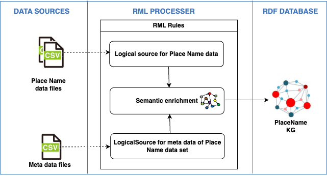
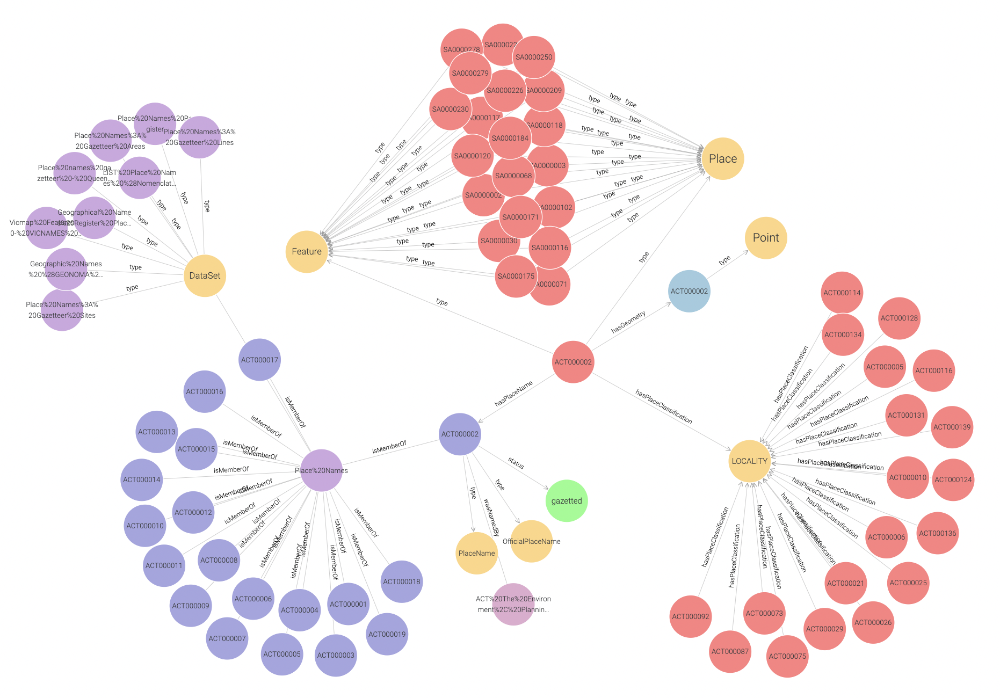

  # semadaten: Semantic Data Enrichment

This repository contains source code and datasets for transparent and reproducible semantic data enrichment of Australian place names data. It is developed by the [Geographic Knowledge Lab (GKL)](https://gkl.rmit.melbourne/).

## Key resources 

- [Geoscience Australia Place Names Ontology](https://geoscienceaustralia.github.io/Placenames-Ontology/placenames.html);
- [Geoscience Australia Place-Names GitHub repository](https://github.com/GeoscienceAustralia/Placenames-Ontology);
- [Composite Gazetteer of Australia](https://placenames.fsdf.org.au/);
- [Data Product Specification for the Composite Gazetteer of Australia](data/CompositeGazetteerDPS.pdf);
- [Linked Data API codebase for National Composite Gazetteer of Australia](https://github.com/GeoscienceAustralia/placenames-dataset); and
- [RML tools](https://rml.io/tools/).

## Repository structure

- **data**: Folder with data from official gazetteers and place names.
- **doc**: Project documentation and examples. 
- **lib**: RML processors and dependencies.
- **pnkg**: Documentation and a link for downloading the PNKG. 
- **src**: RML mapping scripts and data processing codes.

## Data

- Gazetteers directly available in the repository for ACT, NSW, NT, QLD, TAS, VIC, and WA.
- For SA only external link available to download official place names gazatteer due to large file size.
- Data downloaded from authoritative organisations (state) for NSW, QLD, SA< VIC, and WA.
- For ACT, NT, and TAS place names gazetteers were downloaded from the national database, the Composite Gazetteer of Australia. 
- The list of authoritative and non-authoritative organisations for place name gazetteers is available on the [Intergovernmental Committee on Surveying and Mapping (ICSM) website](https://www.icsm.gov.au/individual-state-and-territory-gazetteers).

| Jursdiction | Metadata |                                                                Download Link                                             | Data in GitHub | Last Updated |
| :-------: | ----------- | ------------------------------------------------------------------------------------------------------------------------- | :--------------: | :------------:|
| **ACT** | [Web Link](https://www.data.act.gov.au/dataset/ACT-Feature-Names/kpm6-igvw/about_data)   | [ACT place names in the Composite Gazetteer of Australia](https://placenames.fsdf.org.au/)                  |   [ACT.csv](data/ACT/ACT.csv)  |  25/03/25  |
| **NSW** | [Web Link](https://data.nsw.gov.au/data/dataset/geographical-name-register-of-nsw)         | [Official NSW place names gazetteer](https://data.nsw.gov.au/data/dataset/geographical-name-register-of-nsw/resource/af4e95e2-0dda-44c4-9324-4a025169545c) | [NSW.csv](data/NSW/NSW.csv)        | 25/03/25 |
| **NT**  | [Web Link](https://www.ntlis.nt.gov.au/metadata/export_data?metadata_id=2DBCB7711FB306B6E040CD9B0F274EFE&type=html) | [NT place names in the Composite Gazetteer of Australia](https://placenames.fsdf.org.au/) |  [NT.csv](data/NT/NT.csv)  |  25/03/25 |
| **QLD** | [Web Link](https://www.data.qld.gov.au/dataset/place-names-gazetteer-queensland/resource/ddbaa459-6630-4d89-8221-0fd8da7df39a) | [Official QLD place names gazetteer](https://www.qld.gov.au/environment/land/title/place-names/search)           | [QLD.csv](data/QLD/QLD.csv) |  25/03/25 |
| **SA**  | [Web Link](https://data.sa.gov.au/data/dataset/gazetteer)         | [Official SA place names gazertteer](https://data.sa.gov.au/data/dataset/gazetteer) | [Sites.csv](https://drive.google.com/file/d/1ApYZhCcNoqB37mvkmq9PLYEOpbCkzVt_/view?usp=sharing); [Lines.csv](https://drive.google.com/file/d/19QUnO59D8vHqY7HME0v3F8kzmMoj4gBl/view?usp=sharing); [Areas.csv](https://drive.google.com/file/d/1Yrc9v_O6KvdtiW75PUFzfZD6bERJ4pxi/view?usp=sharing)              | 25/03/25  |
| **TAS** | [Web Link](https://data.thelist.tas.gov.au/datagn/srv/eng/main.home?uuid=d193cd7a-d93a-4ca8-a0a3-670929ad247a)         | [TAS place names in the Composite Gazetteer of Australia](https://placenames.fsdf.org.au/)                     |  [TAS.csv](data/TAS/TAS.csv) | 25/03/25 |
| **VIC** | [Web Link](https://metashare.maps.vic.gov.au/geonetwork/srv/eng/catalog.search#/metadata/b236fd06-a7fc-5ced-8b98-1f022a329b11)          | [Official VIC place names gazetteer](https://maps.land.vic.gov.au/lassi/VicnamesUI.jsp)   | [Sites.csv](data/VIC/VICSites.csv); [Roads.csv](data/VIC/VICRoads.csv)   | 25/03/25 |
| **WA**  | [Web Link](https://catalogue.data.wa.gov.au/dataset/geographic-names-geonoma) | [Official WA place names gazetteer](https://catalogue.data.wa.gov.au/dataset/geographic-names-geonoma)           | [WA.csv](data/WA/WA.csv)               | 25/03/25 |

## Place Name ontology
The below image shows the snapshot of the classes, Object Property (OP), and Data Property (DP) of the [Geoscience Australia Place Name ontology](https://geoscienceaustralia.github.io/Placenames-Ontology/placenames.html). Defined relations in the ontology are used for RML mapping and building PNKG. In the figure below, yellow circles represent classes, blue rectangles indicate object properties, and green rectangles depict data properties.

## Knowledge graph construction
The knowledge construction workflow includes the following stages: 

- data preparation;
- RML mapping and processing; and
- knowledge graph generation.
  
The following figure illustrates the workflow of the knowledge graph construction process.

  

## Place Name Knowledge Graph (PNKG)
This folder contains a link to download the [Australian Place Names Knowledge Graph (PNKG)](http://gkl.rmit.melbourne/kg/pnkg.20250325.ttl), which integrates gazetteer data for all Australian states and territories. The figure below presents a snapshot graph of a section of the PNKG. 

## Further work
The RML mapping and processing stage supports only data in CSV format. To use the same mapping rules, data in other formats must be converted to CSV. Additionally, minor modifications to the mapping rules may be required.

Further work under consideration also includes development of SHACL rules and validate the RDF output for consistency and correctness.

