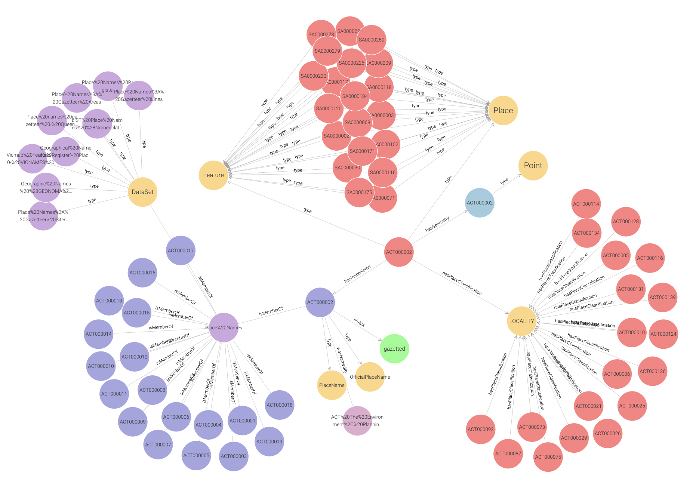

# Place Name Knowledge Graph (PNKG)
This folder contains a link to download the [Australian Place Names Knowledge Graph (PNKG)](https://drive.google.com/file/d/10UWUlq3EuRLq0HCl02-xEPz7JNDZ6Bzn/view?usp=sharing), which integrates gazetteer data for all Australian states and territories. The figure below presents a snapshot graph of a section of the PNKG. 

