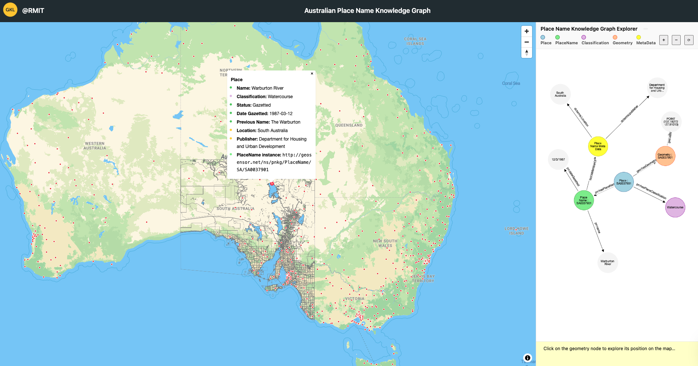

# Web-Based Visualization for Australian placenames knowledge graph

## Transforming Knowledge Graph Geospatial Data for Web-Based Visualization
1. Transform the knowledge graph (TTL) file into a GeoJSON file
   
   The knowledge graph represented in Turtle (TTL) format was converted into a GeoJSON format containing only the geometric data. The resulting GeoJSON includes two fields: "id", which represents the URI of the geometry, and "wkt", which stores the geometry value in Well-Known Text (WKT) format.
   
2. Generate MBTiles file

   Subsequently, the generated GeoJSON file was processed using [Tippecanoe](https://github.com/mapbox/tippecanoe?tab=readme-ov-file), a command-line tool for creating vector tilesets from GeoJSON data. The following command was executed:
   
    To install tippecanoe
      ``` 
      brew install tippecanoe 
      ```
    To generate mbtiles file
    
      ``` 
      tippecanoe -zg \
        -o placenames.mbtiles \
        -l placenames \
        --exclude-all --include=id \
        --generate-ids \
        --extend-zooms-if-still-dropping \
        placenames.geojson
      ```

3. Generate PMTiles file using MBTiles file
   
   Since, PMTiles can be hosted directly on an AWS web server without needing a dedicated tile server, PMTiles file was created using the MBTiles file.
     ```
     pmtiles convert placenames.mbtiles placenames.pmtiles
     ```
## Web Application Architecture
The following figure illustrates the architecture design of the Web Application deployed on AWS cloud environment.
<div align="center">

<p> <strong> Web Application Architecture Diagram </strong></p>
</div>

The web server hosts both the .pmtiles file (used for serving vector tiles) and the indexPNKGweb.html file. The HTML file serves as the interface to the web application, initializing the client-side interface and rendering the map by accessing the .pmtiles file. Based on user selections, such as choosing a specific geometry on the map, the application retrieves the geometry ID and sends it to the GeoSPARQL Fuseki server via SPARQL queries to obtain additional contextual information enriched in the Knowledge Graph. Subsequently, these semantic data will be displayed in the web application interface.

<div align="center">

<p> <strong> Web Interface </strong></p>
</div>
