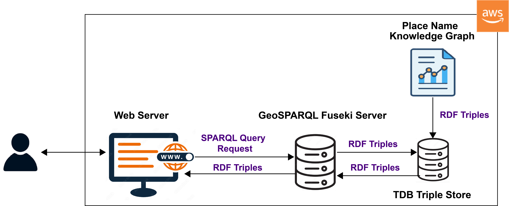

# Web interface: design and implementation

## Techical workflow and dependencies
### 1. Convert Turtle to GeoJSON format
   The knowledge graph, represented in Turtle (.ttl) format, was converted into a GeoJSON file format containing only the geometric data. The resulting GeoJSON file includes two fields: "id", which represents the URI of the geometry, and "wkt", which contains the geometry value in Well-Known Text (WKT) format.
### 2. MBTiles file creation
The generated GeoJSON file was then processed using [Tippecanoe](https://github.com/mapbox/tippecanoe?tab=readme-ov-file), a command-line tool for creating vector tilesets from GeoJSON data. The two commands below were used to create the MBTiles file.

To install tippecanoe:
      
``` 
      brew install tippecanoe 
```
    
To generate mbtiles file:
    
``` 
        tippecanoe -zg \
        -o placenames.mbtiles \
        -l placenames \
        --exclude-all --include=id \
        --generate-ids \
        --extend-zooms-if-still-dropping \
        placenames.geojson
```
### 3. Convert MBTiles to PMTiles
   PMTiles files can be hosted directly on an AWS web server without the need for a dedicated tile server. The PMTiles file was generated from the MBTiles file.
     
```
     pmtiles convert placenames.mbtiles placenames.pmtiles   
```
## Web interface architecture
A persistent triple store was created by loading the pnkg turtle file into Apache Jena TDB. The GeoSPARQL Fuseki server communicates with this store to provide a SPARQL endpoint for querying and managing the data.
The web server hosts both the [.pmtiles file](resources/placenames20250911.pmtiles) (used for serving vector tiles) and the [indexPNKGweb.html](src/indexPNKGweb.html) file. The HTML file serves as the interface to the web application, initializing the client-side interface and rendering the map by accessing the .pmtiles file.
Based on user interactions—such as selecting a specific geometry on the map—the application retrieves the geometry ID and sends it to the GeoSPARQL Fuseki server via SPARQL queries to obtain additional contextual information enriched in the knowldge graph. These semantic data are then displayed within the web application interface. The following image illustrates the architectural design of the web interface deployed in the AWS cloud environment.
<div align="center">

<p> <strong> Web Application Architecture Diagram </strong></p>
</div>
